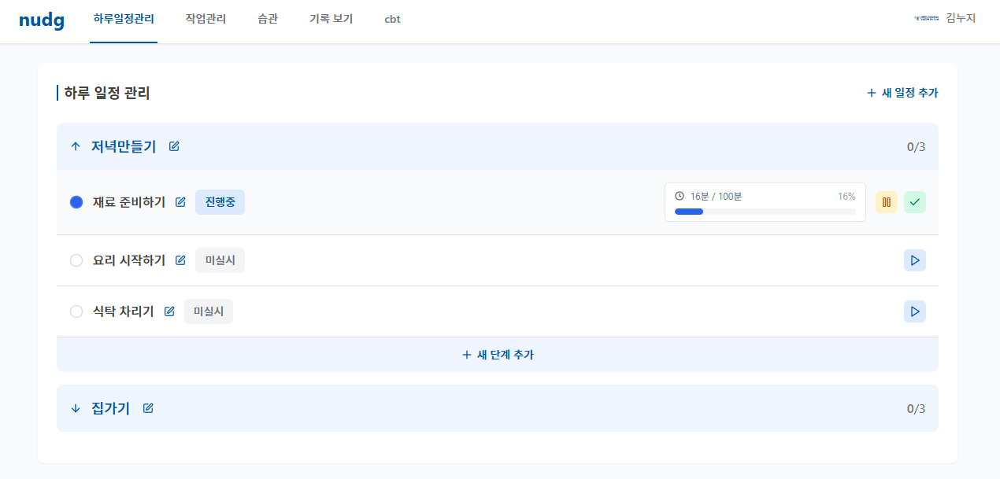

# 기능 정리

## 1. 하루일정관리

### 주요 기능

1. 하루일정을 Task단위로 관리
    1. 그밑의 하위 단계를 Step으로 분리
    2. Step은 진행시간,상태값,정지,시작,완료를 체크
    3. 다음 Step으로 가기 위해선 그전 Step을 반드시 완료해야함(완료상태)
2. 하루안에 다못하면 일정은전부 사라짐 기록보기에는 미완료로 남아있음
    1. 00시 기준으로 초기화 (오후 12시)
    2. 하루안에 Task을 완료 못하면  미완료된 Task들은 미완료상태 그대로 기록보기로 이전
3. Task CRUD 기능
    1. Task들을 수정,생성,삭제 가능 밑의 Step들도 가능